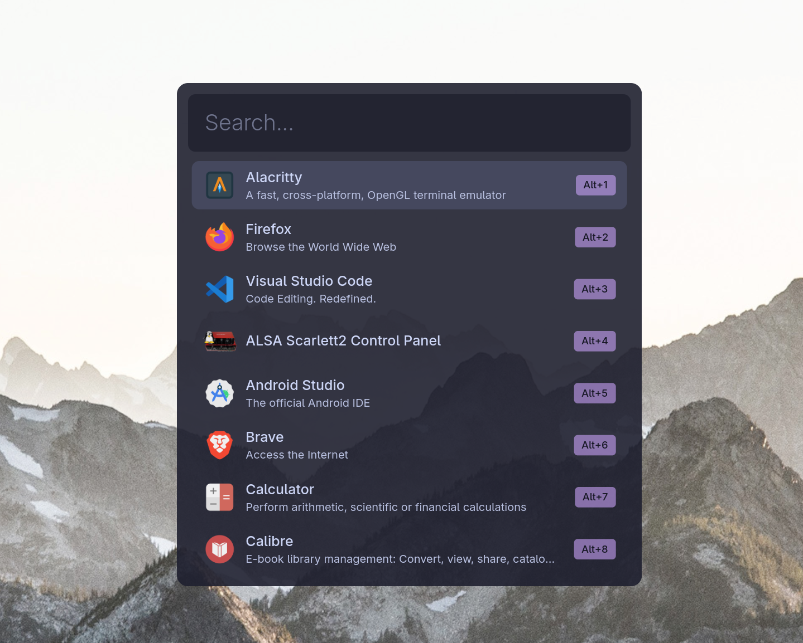

# Yeet


Hey 👋 I'm [@1337Hero](https://github.com/1337hero) and this is Yeet! A fast, minimal app launcher for Wayland. That's it.



## What Yeet Is

Yeet launches apps. That's it. Desktop entry commands run directly (without shell evaluation), and `apps.custom` commands run through the shell so it can also act as a command palette.

- **Fast** — Rust + GTK4, optimized release builds
- **Minimal** — Single binary, no daemons, no bloat
- **Smart search** — Substring-first with Skim fuzzy fallback (junk results filtered automatically)
- **Configurable** — TOML config + CSS theming
- **Wayland-native** — Layer shell overlay with keyboard grab

## What Yeet Isn't

Yeet is not trying to be an all-in-one tool. No clipboard manager, no calculator, no file browser, no emoji picker, no websearch, no plugins. If you want those, check out [walker](https://github.com/abenz1267/walker) or [wofi](https://hg.sr.ht/~scoopta/wofi).

## Installation

### Arch Linux (AUR)

```sh
yay -S yeet-git
```

### Nix

```sh
# Run directly
nix run github:1337hero/yeet

# Install to profile
nix profile install github:1337hero/yeet
```

### From Source

```sh
git clone https://github.com/1337hero/yeet
cd yeet
cargo build --release
sudo cp target/release/yeet /usr/local/bin/
```

**Dependencies:** GTK4, gtk4-layer-shell

## Usage

```sh
yeet
```

- Type to search
- `Enter` — Launch selected app
- `Up/Down` — Navigate results
- `Scroll` / `Trackpad` — Navigate results
- `Alt+1-9` — Quick launch by position
- `Escape` — Close

Bind it to a key in your compositor (e.g., `Super+Space` in Hyprland/Sway).

### dmenu mode

Pipe lines into `yeet --dmenu` and the selection is printed to stdout, so yeet can drive script menus the same way `wofi --dmenu` or `rofi -dmenu` do:

```sh
# Simple picker
selected=$(echo -e "Firefox\nChrome\nBrave" | yeet --dmenu)

# Keybind viewer
grep "^bind" ~/.config/hypr/hyprland.conf | yeet --dmenu
```

Exits non-zero when nothing is selected (Escape).

## Configuration

Config lives in `~/.config/yeet/`. Yeet ships with sensible defaults — only override what you need.

### `config.toml`

```toml
[general]
max_results = 8       # Max results when searching
initial_results = 8   # Results shown before typing (0 = show all, scrollable)
terminal = "alacritty"

[appearance]
width = 500           # Window width (height auto-sizes)
anchor_top = 200      # Distance from top of screen

[search]
min_score = 30        # Absolute floor for fuzzy fallback
score_threshold = 0.6 # Keep matches within % of best score (0.0-1.0)
prefer_prefix = true  # Prioritize exact prefix matches

[apps]
extra_dirs = []       # Additional directories to scan for .desktop files
exclude = ["Htop"]    # Apps to hide (use display names)
favorites = ["Firefox", "Alacritty"]  # Pin to top (use display names)

# Custom app entries
[[apps.custom]]
name = "My Script"
exec = "/path/to/script.sh"
icon = "utilities-terminal"  # optional, from icon theme
keywords = ["alias", "shortcut"]  # optional, extra search terms
```

### Custom Entries

`apps.custom.exec` is passed to the shell, so Yeet doubles as a command palette. Anything you can run in a terminal becomes a launchable "app."

**Power menu:**

```toml
[[apps.custom]]
name = "Logout"
exec = "hyprctl dispatch exit"
icon = "system-log-out"
keywords = ["logout", "sign out", "exit", "session"]

[[apps.custom]]
name = "Shutdown"
exec = "systemctl poweroff"
icon = "system-shutdown"
keywords = ["power off", "shutdown"]

[[apps.custom]]
name = "Reboot"
exec = "systemctl reboot"
icon = "system-reboot"
keywords = ["restart", "reboot"]

[[apps.custom]]
name = "Lock"
exec = "hyprlock"
icon = "system-lock-screen"
keywords = ["lock", "screen"]
```

**Browser profiles:**

```toml
[[apps.custom]]
name = "Chrome - Personal"
exec = "google-chrome-stable --profile-directory=Default"
icon = "google-chrome"
keywords = ["browser", "personal"]

[[apps.custom]]
name = "Chrome - Work"
exec = "google-chrome-stable --profile-directory=\"Profile 1\""
icon = "google-chrome"
keywords = ["browser", "work"]
```

**SSH connections:**

```toml
[[apps.custom]]
name = "SSH - Production"
exec = "alacritty -e ssh user@prod-server"
icon = "utilities-terminal"
keywords = ["ssh", "prod", "server"]
```

**Projects / dev environments:**

```toml
[[apps.custom]]
name = "Project - Yeet"
exec = "code ~/projects/yeet"
icon = "visual-studio-code"
keywords = ["dev", "rust", "launcher"]
```

### `style.css`

Full GTK4 CSS theming. Copy `defaults/style.css` to `~/.config/yeet/style.css` and customize. Default theme is Catppuccin Macchiato with transparency for compositor blur.

```css
/* Use alpha() for compositor blur (Hyprland/Sway) */
.yeet-window {
  background-color: alpha(#1e1e2e, 0.9);
  border-radius: 12px;
}

.yeet-entry {
  font-size: 24px;
  padding: 16px;
  caret-color: #a6e3a1;
}

.yeet-row:selected {
  background-color: #45475a;
}
```

**CSS classes:**
| Class | Element |
|-------|---------|
| `.yeet-window` | Main window |
| `.yeet-container` | Inner container |
| `.yeet-entry` | Search input |
| `.yeet-list` | Results list |
| `.yeet-row` | Result row (supports `:selected`, `:hover`) |
| `.yeet-row-content` | Row inner content |
| `.yeet-icon` | App icon |
| `.yeet-app-name` | App name label |
| `.yeet-app-desc` | App description |
| `.yeet-shortcut` | Alt+N shortcut badge |

## Building

Requires Rust 1.85+ and GTK4 development libraries.

```sh
# Dev build
cargo run

# Release build
cargo build --release

# Format + lint (mirrors CI)
cargo fmt && cargo clippy --all-targets -- -D warnings
```

## Why "Yeet"?

You yeet apps into existence.

## License

GPL-3.0
